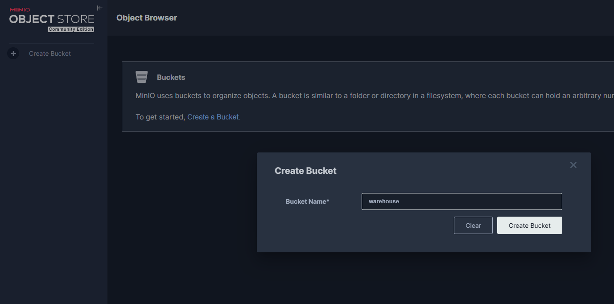
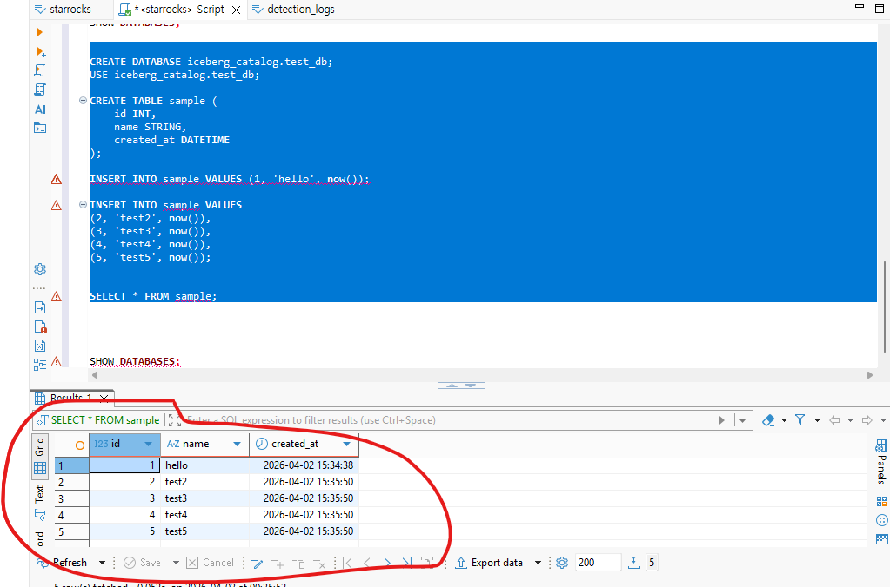
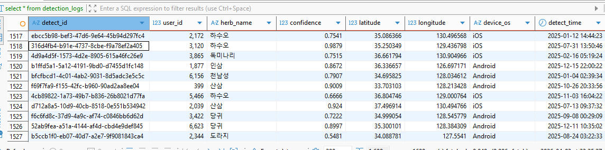

# Spark Test

##  datalake 구축

```
cd datalake
docker-compose up -d

docker ps -a
CONTAINER ID   IMAGE                        COMMAND                  CREATED          STATUS                      PORTS                                                                                                                                   NAMES
bbce7568b03f   apache/spark:3.5.0           "/opt/entrypoint.sh …"   40 minutes ago   Up 40 minutes               0.0.0.0:15002->15002/tcp, [::]:15002->15002/tcp                                                                                         spark-connect
409a57491c4f   starrocks/fe-ubuntu:latest   "/bin/bash -c 'echo …"   40 minutes ago   Exited (0) 40 minutes ago                                                                                                                                           starrocks-init
2eb3b377918a   apache/hive:4.0.0            "sh -c /entrypoint.sh"   40 minutes ago   Up 40 minutes (healthy)     10000/tcp, 0.0.0.0:9083->9083/tcp, [::]:9083->9083/tcp, 10002/tcp                                                                       hive-metastore
cd1606fadaaa   starrocks/be-ubuntu:latest   "/opt/starrocks/be/b…"   40 minutes ago   Up 40 minutes               0.0.0.0:8040->8040/tcp, [::]:8040->8040/tcp, 0.0.0.0:9050->9050/tcp, [::]:9050->9050/tcp                                                starrocks-be
d13bd64957a2   minio/mc:latest              "/bin/sh -c 'mc alia…"   40 minutes ago   Exited (0) 40 minutes ago                                                                                                                                           minio-init
8008cc62368e   apache/kudu:latest           "/kudu-entrypoint.sh…"   40 minutes ago   Up 40 minutes               0.0.0.0:7051->7051/tcp, [::]:7051->7051/tcp, 0.0.0.0:8051->8051/tcp, [::]:8051->8051/tcp                                                kudu-tserver
0be83b577c58   postgres:15                  "docker-entrypoint.s…"   40 minutes ago   Up 40 minutes (healthy)     5432/tcp                                                                                                                                hms-postgres
7f0efbd605e6   starrocks/fe-ubuntu:latest   "/opt/starrocks/fe/b…"   40 minutes ago   Up 40 minutes (healthy)     0.0.0.0:8030->8030/tcp, [::]:8030->8030/tcp, 0.0.0.0:9020->9020/tcp, [::]:9020->9020/tcp, 0.0.0.0:9030->9030/tcp, [::]:9030->9030/tcp   starrocks-fe
7ee6ced2a366   apache/spark:3.5.0           "/opt/spark/bin/spar…"   40 minutes ago   Up 40 minutes               0.0.0.0:7077->7077/tcp, [::]:7077->7077/tcp, 0.0.0.0:8080->8080/tcp, [::]:8080->8080/tcp                                                spark
4006b01c29a2   minio/minio:latest           "/usr/bin/docker-ent…"   40 minutes ago   Up 40 minutes (healthy)     0.0.0.0:9000-9001->9000-9001/tcp, [::]:9000-9001->9000-9001/tcp                                                                         minio
ee639ee53ff5   apache/kudu:latest           "/kudu-entrypoint.sh…"   40 minutes ago   Up 40 minutes               0.0.0.0:7050->7050/tcp, [::]:7050->7050/tcp, 0.0.0.0:8050->8050/tcp, [::]:8050->8050/tcp                                                kudu-master
430d74af61f6   curlimages/curl:latest       "/bin/sh -c 'cd /lib…"   40 minutes ago   Exited (0) 40 minutes ago                                                                                                                                           hms-libs
e8e57548ee5c   hello-world                  "/hello"                 28 hours ago     Exited (0) 28 hours ago                                                                                                                                             bold_blackwell
```


## 접속 정보


## 셋업

디비 베어 접속후

```
ALTER SYSTEM ADD BACKEND "starrocks-be:9050";
SHOW BACKENDS;


CREATE DATABASE IF NOT EXISTS herb24;

USE herb24;


CREATE TABLE detection_logs (
    detect_id VARCHAR(50),
    user_id INT,
    herb_name VARCHAR(50),
    confidence DOUBLE,
    latitude DOUBLE,
    longitude DOUBLE,
    device_os VARCHAR(20),
    detect_time DATETIME
)
DISTRIBUTED BY HASH(detect_id) BUCKETS 3
PROPERTIES(
    "replication_num" = "1"
);
```

## 실행
1. dataGenerator.py 실행
2. uploadData_StarrocksStreamLoadApi.py 실행  10만건의 데이터가 starrocks 에 저장됨


## Spark - Starrocks 데이터 적재
```
(venv) ody@odyssey-2:~/workspace/srt/App$ python uploadData_StarrocksStreamLoadApi.py
🚀 StarRocks로 '/home/ody/workspace/srt/herb24_100k_data.csv' 데이터 적재를 시작합니다...
==================
✅ 업로드 성공! 벼락같은 속도: 0.57초
📊 적재된 행 개수: 500000 건
(venv) ody@odyssey-2:~/workspace/srt/App$
```


1. minio bucket 생성

2. starrocks -> iceberg catalog 연결
```

-- 1. 고장 난 카탈로그 버리기
DROP CATALOG IF EXISTS iceberg_catalog;

-- 2. 새로운 API 주소로 다시 만들기
CREATE EXTERNAL CATALOG iceberg_catalog
PROPERTIES (
    "type" = "iceberg",
    "iceberg.catalog.type" = "rest",
    -- ✨ 핵심 변경: API 경로를 /api/v1/iceberg/ 로 변경!
    "iceberg.catalog.uri" = "http://nessie:19120/iceberg/", 
    "iceberg.catalog.warehouse" = "s3://warehouse/",
    
    "aws.s3.endpoint" = "http://minio:9000",
    "aws.s3.access_key" = "minioadmin",
    "aws.s3.secret_key" = "minioadmin",
    "aws.s3.enable_path_style_access" = "true"
);


```


```

-- 1. 등록된 카탈로그 목록 보기
SHOW CATALOGS;

-- 2. 지금부터 이 Iceberg 카탈로그를 기본으로 사용하겠다고 선언!
SET CATALOG iceberg_catalog;

-- 3. 이 카탈로그(HMS) 안에 데이터베이스가 있는지 확인
SHOW DATABASES;
```

-- iceberg 데이터 적재 확인
```commandline

CREATE DATABASE iceberg_catalog.test_db;
USE iceberg_catalog.test_db;

CREATE TABLE sample (
    id INT,
    name STRING,
    created_at DATETIME
);

INSERT INTO sample VALUES (1, 'hello', now());

INSERT INTO sample VALUES 
(2, 'test2', now()),
(3, 'test3', now()),
(4, 'test4', now()),
(5, 'test5', now());


SELECT * FROM sample;

```



-- minio 확인


## IceBerg Spark 등록

```commandline
 echo "127.0.0.1 minio" | sudo tee -a /etc/hosts
[sudo] password for oracle:
127.0.0.1 minio
(venv) ody@odyssey-1:~/workspace/spark-test/App$ python load_data_with_spark_iceberg.py
🚀 1. Spark Session 초기화 (Iceberg + Hive Metastore Catalog)...
26/04/26 08:26:12 WARN Utils: Your hostname, odyssey-1 resolves to a loopback address: 127.0.1.1; using 192.168.104.211 instead (on interface ens33)
26/04/26 08:26:12 WARN Utils: Set SPARK_LOCAL_IP if you need to bind to another address
:: loading settings :: url = jar:file:/home/ody/workspace/spark-test/venv/lib/python3.12/site-packages/pyspark/jars/ivy-2.5.1.jar!/org/apache/ivy/core/settings/ivysettings.xml
Ivy Default Cache set to: /home/ody/.ivy2/cache
The jars for the packages stored in: /home/ody/.ivy2/jars
org.apache.iceberg#iceberg-spark-runtime-3.5_2.12 added as a dependency
org.apache.iceberg#iceberg-aws-bundle added as a dependency
org.apache.hadoop#hadoop-aws added as a dependency
:: resolving dependencies :: org.apache.spark#spark-submit-parent-02d26964-b7f7-421c-be0f-bbcb4ef050c0;1.0
        confs: [default]
        found org.apache.iceberg#iceberg-spark-runtime-3.5_2.12;1.5.0 in central
        found org.apache.iceberg#iceberg-aws-bundle;1.5.0 in central
        found org.apache.hadoop#hadoop-aws;3.3.4 in central
        found com.amazonaws#aws-java-sdk-bundle;1.12.262 in central
        found org.wildfly.openssl#wildfly-openssl;1.0.7.Final in central
:: resolution report :: resolve 222ms :: artifacts dl 7ms
        :: modules in use:
        com.amazonaws#aws-java-sdk-bundle;1.12.262 from central in [default]
        org.apache.hadoop#hadoop-aws;3.3.4 from central in [default]
        org.apache.iceberg#iceberg-aws-bundle;1.5.0 from central in [default]
        org.apache.iceberg#iceberg-spark-runtime-3.5_2.12;1.5.0 from central in [default]
        org.wildfly.openssl#wildfly-openssl;1.0.7.Final from central in [default]
        ---------------------------------------------------------------------
        |                  |            modules            ||   artifacts   |
        |       conf       | number| search|dwnlded|evicted|| number|dwnlded|
        ---------------------------------------------------------------------
        |      default     |   5   |   0   |   0   |   0   ||   5   |   0   |
        ---------------------------------------------------------------------
:: retrieving :: org.apache.spark#spark-submit-parent-02d26964-b7f7-421c-be0f-bbcb4ef050c0
        confs: [default]
        0 artifacts copied, 5 already retrieved (0kB/8ms)
26/04/26 08:26:12 WARN NativeCodeLoader: Unable to load native-hadoop library for your platform... using builtin-java classes where applicable
Setting default log level to "WARN".
To adjust logging level use sc.setLogLevel(newLevel). For SparkR, use setLogLevel(newLevel).
📦 2. CSV 데이터 읽어오기: /home/ody/workspace/spark-test/herb24_100k_data.csv
root
 |-- detect_id: string (nullable = true)
 |-- user_id: integer (nullable = true)
 |-- herb_name: string (nullable = true)
 |-- confidence: double (nullable = true)
 |-- latitude: double (nullable = true)
 |-- longitude: double (nullable = true)
 |-- device_os: string (nullable = true)
 |-- detect_time: timestamp (nullable = true)

총 500000 건 로드됨
⚡ 3. HMS Iceberg 테이블로 적재 시작...
26/04/26 08:26:23 WARN MetricsConfig: Cannot locate configuration: tried hadoop-metrics2-s3a-file-system.properties,hadoop-metrics2.properties
✅ 4. 적재 검증...
+------+
| total|
+------+
|500000|
+------+

+------------------------------------+-------+---------+----------+---------+----------+---------+-------------------+
|detect_id                           |user_id|herb_name|confidence|latitude |longitude |device_os|detect_time        |
+------------------------------------+-------+---------+----------+---------+----------+---------+-------------------+
|7de6460f-abfd-490c-b0a9-366882919771|512    |인삼     |0.6888    |36.579949|128.190959|Android  |2025-12-10 10:29:34|
|d36cf33c-e560-4f67-8639-68460293082b|9318   |인삼     |0.7531    |34.59787 |128.128703|Android  |2025-05-01 12:08:48|
|b5972df6-4fad-4e9e-afd8-ecef8b735abd|2515   |산삼     |0.5541    |37.165341|130.991427|Android  |2025-05-30 07:40:47|
|5752a51d-bfa3-46b5-a3b8-3e979b87b249|5398   |천남성   |0.6167    |34.764965|128.320756|Android  |2025-12-04 17:49:42|
|8b763ccf-386b-451a-bdda-e417b3cc9375|1391   |인삼     |0.7303    |35.554465|130.142454|Android  |2025-02-19 17:32:49|
+------------------------------------+-------+---------+----------+---------+----------+---------+-------------------+

🎉 Iceberg 적재 완료! StarRocks에서 조회 가능:
  SELECT * FROM iceberg_catalog.test_db.detection_logs LIMIT 10;
(venv) ody@odyssey-1:~/workspace/spark-test/App$
```

-- dbBear 에서 확인
```commandline
SHOW DATABASES

use test_db

show tables

select * from detection_logs
```



## spark-connect

```commandline
(venv_win) PS F:\project\mvp\starrocks_test\srt> pip install --index-url https://pypi.org/simple pandas pyarrow "pyspark[connect]==3.5.0"
Collecting pandas
  Downloading pandas-2.3.3-cp310-cp310-win_amd64.whl.metadata (19 kB)
Collecting pyarrow
  Downloading pyarrow-23.0.1-cp310-cp310-win_amd64.whl.metadata (3.1 kB)
Requirement already satisfied: pyspark==3.5.0 in .\venv_win\lib\site-packages (from pyspark[connect]==3.5.0) (3.5.0)
Requirement already satisfied: py4j==0.10.9.7 in .\venv_win\lib\site-packages (from pyspark==3.5.0->pyspark[connect]==3.5.0) (0.10.9.7)
Collecting grpcio>=1.56.0 (from pyspark[connect]==3.5.0)
  Downloading grpcio-1.80.0-cp310-cp310-win_amd64.whl.metadata (3.9 kB)
Collecting grpcio-status>=1.56.0 (from pyspark[connect]==3.5.0)
  Downloading grpcio_status-1.80.0-py3-none-any.whl.metadata (1.3 kB)
Collecting googleapis-common-protos>=1.56.4 (from pyspark[connect]==3.5.0)
  Downloading googleapis_common_protos-1.74.0-py3-none-any.whl.metadata (9.2 kB)
Collecting numpy>=1.15 (from pyspark[connect]==3.5.0)
  Downloading numpy-2.2.6-cp310-cp310-win_amd64.whl.metadata (60 kB)
Collecting python-dateutil>=2.8.2 (from pandas)
  Using cached python_dateutil-2.9.0.post0-py2.py3-none-any.whl.metadata (8.4 kB)
Collecting pytz>=2020.1 (from pandas)
  Downloading pytz-2026.1.post1-py2.py3-none-any.whl.metadata (22 kB)
Collecting tzdata>=2022.7 (from pandas)
  Downloading tzdata-2026.1-py2.py3-none-any.whl.metadata (1.4 kB)
Collecting protobuf<8.0.0,>=4.25.8 (from googleapis-common-protos>=1.56.4->pyspark[connect]==3.5.0)
  Downloading protobuf-7.34.1-cp310-abi3-win_amd64.whl.metadata (595 bytes)
Collecting typing-extensions~=4.12 (from grpcio>=1.56.0->pyspark[connect]==3.5.0)
  Using cached typing_extensions-4.15.0-py3-none-any.whl.metadata (3.3 kB)
Collecting protobuf<8.0.0,>=4.25.8 (from googleapis-common-protos>=1.56.4->pyspark[connect]==3.5.0)
  Downloading protobuf-6.33.6-cp310-abi3-win_amd64.whl.metadata (593 bytes)
Collecting six>=1.5 (from python-dateutil>=2.8.2->pandas)
  Using cached six-1.17.0-py2.py3-none-any.whl.metadata (1.7 kB)
Downloading pandas-2.3.3-cp310-cp310-win_amd64.whl (11.3 MB)
   ━━━━━━━━━━━━━━━━━━━━━━━━━━━━━━━━━━━━━━━━ 11.3/11.3 MB 64.4 MB/s  0:00:00
Downloading pyarrow-23.0.1-cp310-cp310-win_amd64.whl (27.5 MB)
   ━━━━━━━━━━━━━━━━━━━━━━━━━━━━━━━━━━━━━━━━ 27.5/27.5 MB 41.6 MB/s  0:00:00
Downloading googleapis_common_protos-1.74.0-py3-none-any.whl (300 kB)
Downloading grpcio-1.80.0-cp310-cp310-win_amd64.whl (4.9 MB)
   ━━━━━━━━━━━━━━━━━━━━━━━━━━━━━━━━━━━━━━━━ 4.9/4.9 MB 59.3 MB/s  0:00:00
Using cached typing_extensions-4.15.0-py3-none-any.whl (44 kB)
Downloading grpcio_status-1.80.0-py3-none-any.whl (14 kB)
Downloading protobuf-6.33.6-cp310-abi3-win_amd64.whl (437 kB)
Downloading numpy-2.2.6-cp310-cp310-win_amd64.whl (12.9 MB)
   ━━━━━━━━━━━━━━━━━━━━━━━━━━━━━━━━━━━━━━━━ 12.9/12.9 MB 15.0 MB/s  0:00:00
Using cached python_dateutil-2.9.0.post0-py2.py3-none-any.whl (229 kB)
Downloading pytz-2026.1.post1-py2.py3-none-any.whl (510 kB)
Using cached six-1.17.0-py2.py3-none-any.whl (11 kB)
Downloading tzdata-2026.1-py2.py3-none-any.whl (348 kB)
Installing collected packages: pytz, tzdata, typing-extensions, six, pyarrow, protobuf, numpy, python-dateutil, grpcio, googleapis-common-protos, pandas, grpcio-status
Successfully installed googleapis-common-protos-1.74.0 grpcio-1.80.0 grpcio-status-1.80.0 numpy-2.2.6 pandas-2.3.3 protobuf-6.33.6 pyarrow-23.0.1 python-dateutil-2.9.0.post0 pytz-2026.1.post1 six-1.17.0 typing-extensions-4.15.0 tzdata-2026.1
(venv_win) PS F:\project\mvp\starrocks_test\srt> 
```


```commandline
(venv) ody@odyssey-2:~/workspace/srt/App$ python load_to_iceberg_connect.py
🚀 1. Spark Connect Server 연결 중 (sc://localhost:15002)...
📦 2. Pandas로 데이터 읽기: herb24_100k_data.csv
🔄 3. Pandas DF -> Spark DF 변환 및 전송 (건수: 500000)
⚡ 4. Iceberg 테이블 적재 시작 (hive.test_db.detection_logs)...
✅ 5. 적재 데이터 검증 (Spark SQL)
+------+
| total|
+------+
|500000|
+------+

+------------------------------------+-------+---------+----------+---------+----------+---------+-------------------+
|detect_id                           |user_id|herb_name|confidence|latitude |longitude |device_os|detect_time        |
+------------------------------------+-------+---------+----------+---------+----------+---------+-------------------+
|81ef5e9f-06ac-4693-ab19-02625c31deb3|2286   |도라지   |0.8499    |34.534691|128.542772|Android  |2025-11-13 10:27:17|
|effa944c-b9dc-4d10-9a93-5eebff3a7cf3|83     |인삼     |0.5412    |37.528756|126.295331|Android  |2025-12-09 10:33:01|
|d565942a-2972-48a3-add0-1a0ef62a0726|3052   |독미나리 |0.5366    |34.858701|130.567228|iOS      |2025-03-09 12:28:04|
|d2c20c38-5c1f-46d8-b6ef-dd2204a6a216|9201   |독미나리 |0.6656    |36.829234|127.29211 |Android  |2025-12-05 17:41:19|
|24b32b65-1322-4851-9888-b5f74c268a67|5837   |독미나리 |0.8301    |36.251096|130.930584|iOS      |2025-12-06 23:56:22|
+------------------------------------+-------+---------+----------+---------+----------+---------+-------------------+

🎉 Iceberg 적재 완료!
StarRocks 조회 확인:
  SELECT * FROM iceberg_catalog.test_db.detection_logs LIMIT 10;
(venv) ody@odyssey-2:~/workspace/srt/App$
```


---

# Performance TEST

```commandline
 echo "192.168.45.102 tst-server" | sudo tee -a /etc/hosts
```